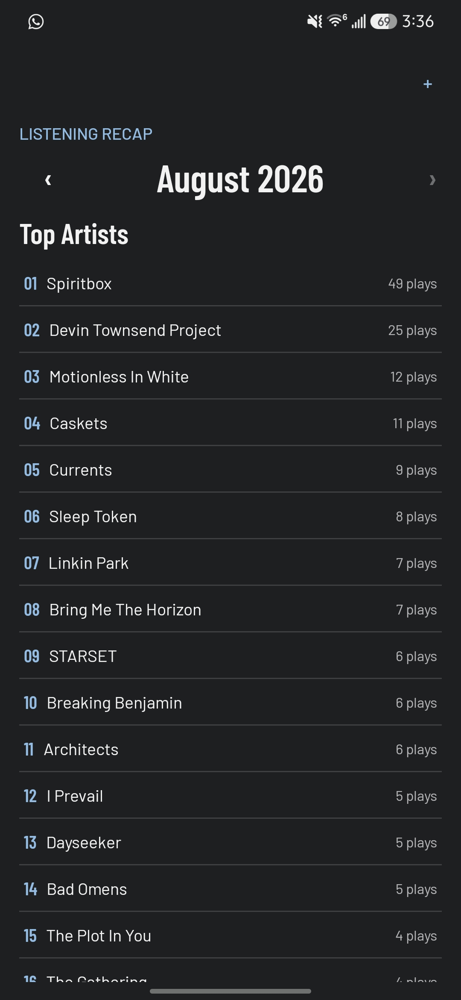
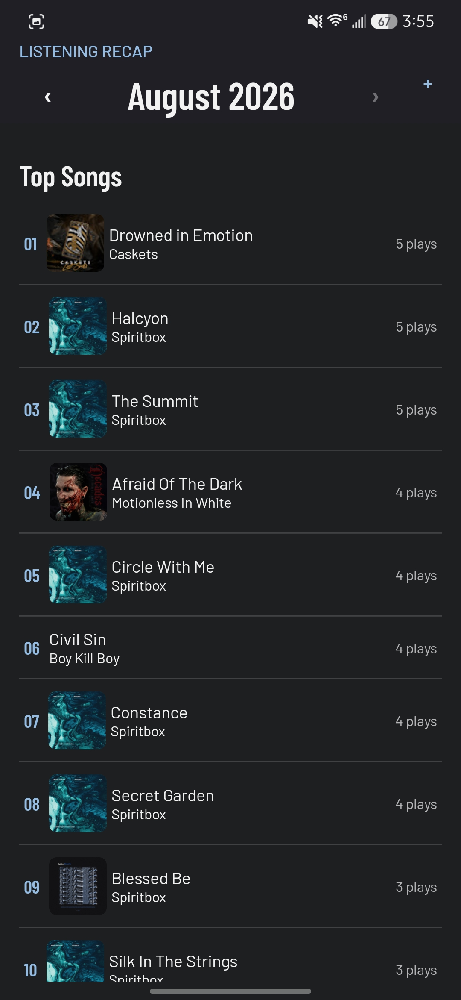
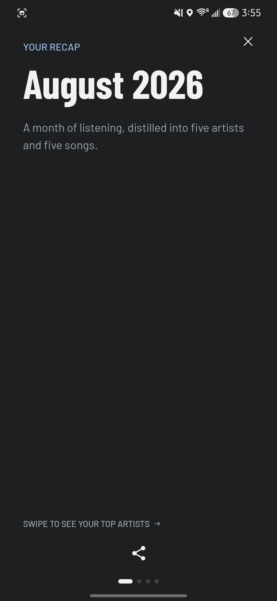
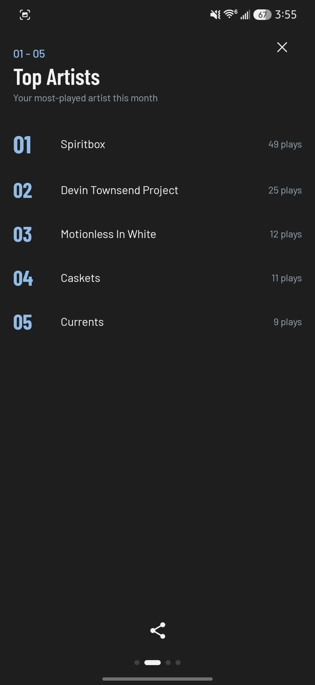
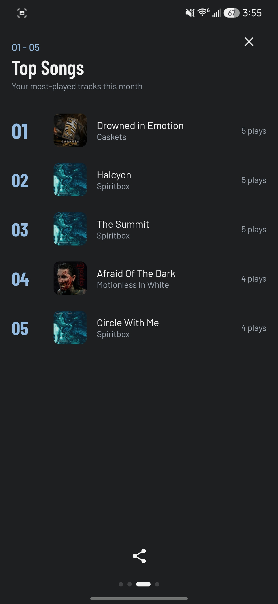
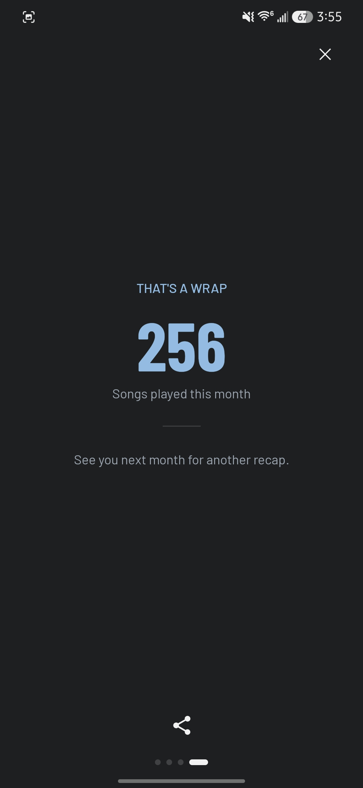

# Music Tracker

Tracks songs you play on YouTube Music — on Android and in the browser — with monthly top-artists and top-songs stats.

## Screenshots

<p>
  
  
  
  
  
  
</p>

## Monorepo structure

```
music-tracker/
├── music-tracker-app/   # Phase 1 — Android app + Phase 3 — Supabase sync
└── music-tracker-ext/   # Phase 2 — Chrome / Brave extension
```

---

## Phase 1 — Android app

Captures playback via `NotificationListenerService` + `MediaSessionManager`. Stores history in a local Room/SQLite database and shows monthly stats in a Jetpack Compose UI.

**Stack:** Kotlin · Jetpack Compose · Material3 · Room · Coroutines + Flow

### Setup

Open `music-tracker-app/` in Android Studio and run on a device or emulator (API 24+).

After installing, grant **Notification Access** in system settings:
> Settings → Apps → Special app access → Notification access → Music Tracker → Allow

---

## Phase 2 — Browser extension

Tracks songs played on [music.youtube.com](https://music.youtube.com) using the Media Session API. Stores play history locally in `chrome.storage.local` and shows monthly stats in a popup.

**Stack:** TypeScript · React · Vite · Chrome MV3

### How it works

| Script | World | Role |
|---|---|---|
| `content/inject.ts` | MAIN | Polls `navigator.mediaSession` every 500 ms, tracks pauses, detects skips, posts finalized plays via `window.postMessage` |
| `content/index.ts` | ISOLATED | Relays plays to the background via `chrome.runtime.sendMessage` |
| `background/index.ts` | Service Worker | Persists plays to `chrome.storage.local`, computes top-20 stats |
| `popup/` | Extension page | Month navigation · Artists / Songs tabs · ranked list |

Skip detection mirrors the Android app: a play is marked skipped when `listenedMs < 70% of durationMs`. Plays shorter than 15 s are discarded.

### Install (development)

```bash
cd music-tracker-ext
npm install
npm run build
```

Then in Chrome or Brave:
1. Go to `chrome://extensions`
2. Enable **Developer mode**
3. Click **Load unpacked** → select the `dist/` folder

### Development (watch mode)

```bash
npm run dev
```

Rebuilds automatically on file changes. After each rebuild, click the reload icon on the extension card in `chrome://extensions`, then hard-refresh the YouTube Music tab.

---

## Design system

Both apps share the same visual language.

| Token | Light | Dark |
|---|---|---|
| Background | `#f2f2f3` | `#1d1f20` |
| Text | `#1d1f20` | `#f2f2f3` |
| Accent | `#416180` | `#94bce3` |

Fonts: **Barlow** (body) · **Barlow Condensed** (display, ranks, counts)
